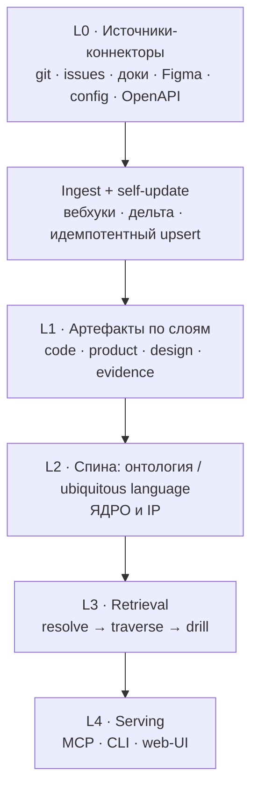

# Технический проект v2 — онтологический мост продукт ↔ код

### Рабочее имя: **Rosetta** (переводит между языком продукта и языком кода)

*Консолидированный документ. Пересобирает всю идею и архитектуру вокруг главного инсайта: спина системы — это терминология (ubiquitous language / онтология домена), а не структурный код-граф.*

---

## 1. Идея (финальная формулировка)

Двусторонний мост между продуктом и кодом, построенный вокруг **спины из терминологии**. У LLM появляется контекст как у разработчика — документация, Figma, код, конфиги, фичи — но не плоской свалкой, а **навигируемой по понятиям**: модель сперва резолвит термин в концепт, потом точечно ныряет вглубь. Это `ontology-first`, а не top-k семантический поиск.

Две стороны моста:

- **Code-side:** агент пишет/меняет код, видя продуктовый и дизайн-интент → не нарушает продукт.
- **Product-side:** вопрос «как/почему это работает» → ответ, заземлённый в реальном коде.

---

## 2. Позиционирование (честно, по рынку июня 2026)

| Категория | Кто | Чего не хватает под твою задачу |
|---|---|---|
| Структурные код-графы | GitNexus, Graphify, CodeGraph (15–28k⭐) | дают структуру, не интент; коммодити |
| Широкий retrieval | Unblocked ($20M), Glean, Augment | плоский Q&A, нет явной онтологии-спины |
| Ontology-first (data) | Palantir Ontology/AIP, Stardog | enterprise-data/BI, не dev-first, не код+Figma |
| DDD ubiquitous language | `sdd-glossary`, verifier, скиллы | это скрипты/скиллы, не продукт |

**Незанятая форма:** dev-first продукт, чья спина — авто-построенная ubiquitous-language онтология кода+продукта+Figma, отдаваемая агентам через MCP с `ontology-first` ретривалом. Ингредиенты есть, собранного продукта — нет.

**Риски (держать в голове):** бутстрап онтологии тяжёлый; не-DDD команды дают грязные/отсутствующие термины; WTP при бесплатном плумбинге; дрейф Palantir в «context graphs». Поэтому — концьерж-валидация ДО стройки.

---

## 3. Архитектура (пересмотренная): 4 слоя + спина



- **L0 Sources** — коннекторы (плагин-контракт): git, GitHub Issues, Notion/доки, **Figma**, конфиги, OpenAPI, CI.
- **L1 Extraction** — структурный код-граф (берём готовый: SCIP/tree-sitter или поверх GitNexus/Graphify) + артефакты из источников.
- **L2 Ontology spine (ядро/IP)** — концепты (ubiquitous language), связи concept↔concept и привязки concept→artifact. Авто-построение + петля подтверждения.
- **L3 Retrieval** — `resolve → traverse → drill`, гибрид с вектором для recall.
- **L4 Serving** — MCP (агенту отдаём подграф вокруг концептов в работе), CLI, web-UI (граф + курация).

---

## 4. Онтологический движок (главная инженерия)

Пайплайн построения спины:

1. **Сбор кандидатов-терминов** из всех источников: идентификаторы кода (типы, модули, функции — tree-sitter/SCIP), заголовки доков, эпики/лейблы тикетов, имена фреймов и компонентов Figma, ключи конфигов, частотный анализ доменных слов (как DDD-verifier).
2. **Канонизация и кластеризация:** эмбеддинги + кластеризация синонимов → кандидат-концепт; LLM предлагает каноническое имя, определение и bounded-context.
3. **Связи:** concept↔concept (`is-a`, `part-of`, `depends-on`) и concept→artifact (`реализуется-в`, `описан-в`, `нарисован-в`, `управляется-флагом`) — детерминированно где есть ссылки (PR/issue, CODEOWNERS, Figma-link), инференсом где нет.
4. **Петля подтверждения (human-in-the-loop):** инженер/продакт подтверждает или правит концепт и связи → ground truth + сигнал. Это проприетарный актив и моат.
5. **Self-update:** на новых коммитах/тикетах/Figma-изменениях — дельта-переэкстракт; новые термины в очередь на подтверждение; инференс-связи с decay по времени.

Схема данных:

```
Concept { id, name, definition, bounded_context, aliases[], embedding }
Artifact { id, layer: code|product|design|evidence|config, ref, attrs, embedding }
Edge { src, dst, type, source: deterministic|inferred|human, confidence, evidence[], validFrom }
```

---

## 5. Модель ретривала (ontology-first)

Алгоритм запроса:

1. Резолв запроса → концепт(ы) в спине (по имени/алиасам/эмбеддингу).
2. Обход подграфа вокруг концепта (k хопов, фильтр по типам рёбер и порогу confidence).
3. Точечный спуск к артефактам (код-символы, секции доков, Figma-фреймы, конфиг-флаги).
4. Сборка компактного контекста → агенту (code-side) или ответ (product-side).

Почему не плоский RAG: ontology-grounded бьёт вектор (в замерах заземление 16%→56%; multi-hop 80–85% vs 45–50%), даёт меньше токенов и объяснимость (provenance). Гибрид: вектор для recall кандидатов, граф для точности и multi-hop.

---

## 6. Build-on-top (не с нуля)

Движок — коммодити; собирай из готового, твоя IP — спина + связки + курация + serving:

- **Код-структура:** SCIP/tree-sitter, либо поверх GitNexus/Graphify (MIT).
- **Онтология-RAG оркестрация:** LlamaIndex/LangChain или своё лёгкое; Stardog/Neo4j как референс для онтологий.
- **Хранилище:** граф (Kùzu local / Neo4j server) + вектор (sqlite-vec/LanceDB local / pgvector server).
- **Figma:** официальный Figma API (фреймы, компоненты, dev-mode аннотации) — твой свежий, незанятый коннектор.
- **Serving:** MCP SDK (`registerTool`), CLI, web-UI (Sigma.js для графа).

---

## 7. MVP-срез (узко, исполнимо по вечерам)

- **Источники:** код (tree-sitter, 1 язык) + GitHub Issues + **Figma (1 проект)** + доки.
- **Спина:** авто-кандидаты + ручное подтверждение ~50 ключевых концептов одного bounded-context.
- **Retrieval:** `resolve → traverse → drill`, отдаём через MCP `concept_context` + CLI `why/what`.
- **Демо:** «спроси про фичу → получи концепт со связками код ↔ Figma ↔ правило».

**Не делаем в MVP:** федерацию, мульти-язык, авто-онтологию без подтверждения, широкий enterprise-поиск.

---

## 8. Стадии

- **v0 MVP** — выше.
- **v1** — больше коннекторов, инкрементальное self-update, web-UI курации, инференс-связи.
- **v2** — федерация систем A↔B по манифесту `system.graph.yaml` (boundary + links).

---

## 9. Риски и митигигация

- **Бутстрап онтологии** — самый тяжёлый кусок → авто-кандидаты + узкий bounded-context + петля подтверждения.
- **Грязные/отсутствующие термины** (не-DDD команды) → сильный авто-экстрактор и канонизация важнее, чем кажется.
- **WTP при бесплатном плумбинге** → концьерж-валидация ДО кода (см. отдельный кит).
- **Фича vs продукт** → моат в проприетарной подтверждённой онтологии + Figma-интент + dev-first дистрибуции.

---

## 10. Прайор-арт и словарь (на чём стоишь)

DDD ubiquitous language (Evans); ontology-first AI architecture (Atlan), SOEF; Palantir Ontology/AIP, Stardog (ontology-grounded RAG); GraphRAG (граф vs вектор); SCIP/tree-sitter (код-слой); MCP как «мини-онтологии».

---

*Это консолидированный проект, заменяющий ранние фрагменты. Следующий шаг по твоему выбору — валидация (концьерж) или v0-скелет поверх готового движка с Figma-коннектором.*
