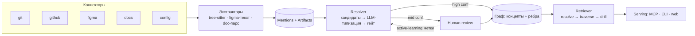

# Rosetta — архитектура и план разработки

*Исполнимый build-документ. Двусторонний мост продукт ↔ код вокруг онтологической спины; концептуальная (язык-агностичная, для легаси) линковка; ontology-first выдача через MCP. Собирается поверх готовых движков, строится по фазам — каждая даёт что-то рабочее.*

---

## Принципы (не нарушать)

1. **Движок не пишем с нуля** — структуру кода и графовое хранилище берём готовыми; IP = спина + линковка + курация + serving.
2. **Детерминизм сперва, инференс поверх.** Якоря дают костяк без галлюцинаций; LLM-инференс только как предложения.
3. **Никаких прямых Figma↔код рёбер.** Обе стороны цепляются к концепту; связь — путь через концепт (отсюда язык-агностичность и работа на легаси).
4. **Человек подтверждает спорное.** Подтверждённые связи = ground truth и проприетарный датасет (моат).
5. **Узкий MVP, швы под будущее** (мульти-язык, федерация) проектируем, но не реализуем рано.

---

## Архитектура (data flow)



Слои: **L0** коннекторы → **L1** экстракторы (mentions/artifacts) → **L2** resolver строит **спину концептов** → **L3** retriever (ontology-first) → **L4** serving (MCP/CLI/web). Петля Human review кормит resolver метками (active learning).

---

## Модель данных (SQLite v0)

```sql
concepts(
  id, name, definition, bounded_context,
  aliases_json, embedding, status            -- candidate | confirmed
)
artifacts(
  id, kind, layer, source, ref, title, body,
  embedding, attrs_json                      -- kind: code_symbol|file|frame|component|issue|pr|commit|doc|config
)                                            -- layer: code|design|product|evidence|config
mentions(
  id, artifact_id, term, normalized, span, embedding
)
edges(
  id, src_id, dst_id, type, source,          -- type: implements|describes|depicts|constrains|changed|references|belongs_to
  confidence, evidence_json, valid_from, status  -- source: deterministic|inferred|human ; status: proposed|confirmed|rejected
)
```

Обход — рекурсивный CTE по `edges` с фильтром по типам и порогу `confidence`. Вектор — `sqlite-vec` на `embedding`.

---

## Алгоритм линковки (ядро / IP)

```
1. EXTRACT  — из каждого источника достаём mentions (термины) + artifacts.
              код: tree-sitter → идентификаторы, имена fn/class, комментарии, строки (любой язык).
              figma: имена фреймов/слоёв, текст-контент, имена флоу (+ vision-эмбеддинг рендера).
              evidence: текст PR/issue/commit. docs: заголовки/секции. config: ключи.

2. CANDIDATES — нормализуем термины (split camel/snake, lemmatize), эмбеддим,
                кластеризуем синонимы → кандидаты-концепты.

3. CANONICALIZE — LLM даёт концепту каноническое имя, определение, bounded_context.

4. LINK artifact → concept по сигналам (от точного к нечёткому):
   a. детерминированные якоря (PR«Closes #»→issue→epic; CODEOWNERS; Figma Code Connect если есть)
   b. лексика (общий термин == ubiquitous language)
   c. эмбеддинг (кандидат, не финал)
   d. EVIDENCE-МОСТ: тех-имя кода (Txn.validate) ← PR «add refund validation» → концепт Refund
      (закрывает разрыв словарей на легаси)

5. TYPE+SCORE — LLM типизирует ребро (implements/describes/depicts/constrains)
                с ОБЯЗАТЕЛЬНОЙ уликой; нет улики → отклонить. Выдаёт confidence.

6. GATE — high → авто в граф; mid → очередь Human review; low → дроп.

7. CONFIRM — человек подтверждает/правит → status=confirmed → метка для active learning.

8. SELF-UPDATE — на новых коммитах/тикетах/figma-дельтах: переэкстракт дельты,
                 новые термины в очередь, инференс-рёбра теряют confidence (decay) до переподтверждения.
```

Figma↔код: **никогда напрямую** — оба линкуются к концепту (шаг 4), связь = путь через концепт. Омонимы решаются `bounded_context` (шаг 3).

---

## Стек (v0, прагматично)

- **Язык:** TypeScript (под MCP/CLI/Figma API/web в одном), `pnpm`.
- **Хранилище:** `better-sqlite3` + `sqlite-vec` (граф+вектор, ноль инфры). Kùzu/Neo4j — опционально позже.
- **Код-парс:** `web-tree-sitter` + грамматики нужных языков (Kotlin/Dart/TS/…).
- **Эмбеддинги/LLM:** провайдер-агностик (OpenAI/Anthropic/Voyage) за интерфейсом.
- **Figma:** REST API (+ по желанию Figma MCP как источник Code Connect-якорей).
- **MCP:** `@modelcontextprotocol/sdk` (`registerTool`).
- **Web (позже):** Sigma.js/Cytoscape для графа и курации.

---

## Структура репозитория

```
rosetta/
  packages/
    core/         # схема, типы, graph-store (sqlite), traversal
    connectors/   # git, github, figma, docs, config
    extractors/   # treesitter-code, figma-text, doc-parse → mentions/artifacts
    resolver/     # candidates, canonicalize, link, llm-type, gate, active-learning
    retriever/    # ontology-first: resolve→traverse→drill (+vector hybrid)
  apps/
    cli/          # rosetta <cmd>
    mcp-server/   # concept_context / why_code
    web/          # граф + очередь подтверждения (позже)
```

---

## План разработки (по фазам, «потихоньку»)

Каждая фаза = пара вечеров и **рабочий результат (DoD)**. Не начинай следующую, пока предыдущая не запускается.

### Фаза 0 — Скелет и модель данных
- Монорепо (pnpm), `core` со схемой SQLite + миграции, `rosetta init`.
- **DoD:** `rosetta init` создаёт БД; пустой граф читается запросом.

### Фаза 1 — Код → mentions (любой язык)
- `extractors/treesitter-code`: на тестовом репо (твой язык) достаём идентификаторы, имена fn/class, комментарии, строки → `mentions` + `artifacts(kind=code_symbol/file)`.
- **DoD:** `rosetta ingest code <repo>` наполняет mentions; `rosetta terms` показывает топ-термины.

### Фаза 2 — Evidence → mentions + детерминированные якоря
- `connectors/git` (log/blame) + `connectors/github` (Issues API). Рёбра-якоря `code—changed—PR—references—issue—belongs_to—epic`.
- **DoD:** `rosetta ingest github <repo>`; `rosetta why <file>` уже отдаёт цепочку PR→issue (на детерминизме, без концептов).

### Фаза 3 — Спина концептов (ядро)
- `resolver`: candidates (нормализация+эмбеддинг+кластеризация) → canonicalize (LLM) → link artifact→concept (+ evidence-мост) → type+score → gate.
- Скоуп: ~50 концептов одного `bounded_context`.
- **DoD:** `rosetta build-ontology --context <name>`; `rosetta concept <name>` показывает связанный код + evidence.

### Фаза 4 — Figma + концептуальный линк
- `connectors/figma` (REST: фреймы, слои, текст) → mentions; линк frame→concept; (опц. vision-эмбеддинг рендера).
- **DoD:** `rosetta ingest figma <fileKey>`; `rosetta concept Refund` показывает **код + Figma + правило** разом — связь через концепт работает.

### Фаза 5 — Гейт + петля подтверждения
- Очередь `proposed`-рёбер; `rosetta review` (CLI) подтвердить/отклонить; `confirmed` сохраняется как метка.
- **DoD:** подтверждения персистятся; копится датасет связей (твой моат).

### Фаза 6 — MCP serving
- `apps/mcp-server`: тулзы `concept_context(term)` и `why_code(path)` → резолв → обход → подграф агенту.
- **DoD:** Cursor/Claude Code подключены; агент получает продукт+дизайн+код контекст для файла/термина. ← **это твой демо-артефакт для валидации/концьержа.**

### Фаза 7 — Retriever + web-UI (позже)
- Ontology-first ретривал (resolve→traverse→drill, гибрид с вектором), Sigma.js граф + курация в вебе.

### Фаза 8 — Федерация v2 (сильно позже)
- `system.graph.yaml` (boundary + links), overlay между системами A↔B.

---

## Где встречается бизнес

После **Фазы 6** у тебя рабочий MCP на 1 реальном репо + Figma — это и есть концьерж-демо. Не строй фазы 7–8 до того, как покажешь это живым командам и проверишь готовность платить (валидационный кит). Фазы 1–4 уже достаточно, чтобы собрать спину руками для первой команды.

---

## Риски и cutlines

- **Phantom links** (инференс без Code Connect) → evidence-required + гейт + подтверждение. Не ослаблять.
- **Омонимы/синонимы** → `bounded_context` обязателен с Фазы 3.
- **Не строй раньше времени:** мульти-язык за пределами тестового, web-UI, федерацию, авто-онтологию без подтверждения — всё это после Фазы 6.

---

*Старт — Фаза 0. Когда будешь готов, могу сгенерировать скелет Фазы 0 (монорепо + схема + `rosetta init`) или заточить Фазу 1 под конкретный язык/репо, на котором будешь тестить.*
