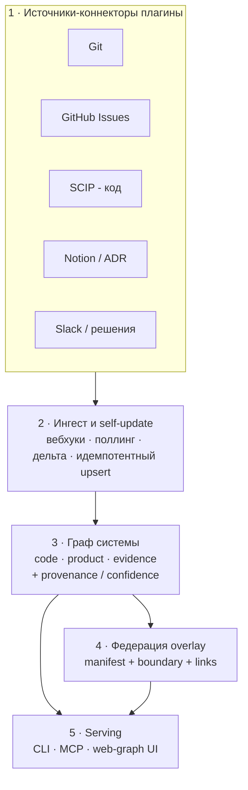
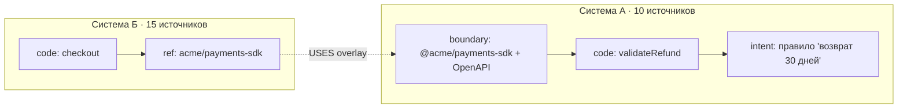

# Тех-архитектура: движок графа знаний

## multi-source · self-updating · federated

*Технический реализм под твою идею «как GitNexus, но шире»: бесконечные источники → граф на систему → авто-обновление → федерация графов между системами.*

---

## Позиционирование: «GitNexus, но шире»

**GitNexus** = client-side движок: 4-pass AST-пайплайн → **KùzuDB** (встраиваемый граф) → визуализация на Sigma.js (WebGL) → **MCP** с 16 тулзами (impact-анализ, поиск по процессам, 360°-вид символа, change detection), обход через Cypher (не вектора). Но он: **только код, один репозиторий, структура.**

Твой продукт берёт его планку (MCP-native + визуализация + Cypher-обход) и расширяет по трём осям:

1. **Много источников** — код лишь один из них: git, issues, ADR/PRD, Notion, Slack, OpenAPI, CI…
2. **Слой продукта/интента** — первоклассный, а не только структура кода.
3. **Федерация систем** — графы связываются между собой по спецификации.

---

## Главное решение: не писать движок с нуля

Само-обновляемый граф из многих источников — уже решённый класс. Встань на готовое:

- **Cognee** — 30+ коннекторов (PDF, Slack, Notion, БД…), local-first стек (**SQLite + LanceDB + Kùzu**), гибрид граф+вектор. Минус: апдейт сейчас «clean & replace», не инкрементально.
- **Graphiti (Zep)** — **инкрементальный, темпоральный** граф, обновляется по мере поступления данных без пересчёта, «несколько графов сосуществуют в одном сетапе», на Neo4j. Ближе всего к «само-обновляется» + «много графов».

**Твоя IP — не ингестор**, а: (1) набор коннекторов *код + продукт*, (2) 3-слойная схема трассируемости, (3) **спека федерации**, (4) `why`-поверхность. Ингест и хранилище — на Graphiti или Cognee. GitNexus задаёт планку для код-слоя и MCP — догони и расширь.

---

## Пять слоёв архитектуры



---

## Слой 1 — контракт коннектора (это и есть «переиспользуемый, бесконечные источники»)

```ts
interface SourceConnector {
  id: string;                                  // "github-issues"
  discover(): Promise<Resource[]>;             // что вообще есть у источника
  pull(cursor?: Cursor): Promise<RawBatch>;    // дельта с прошлого раза
  extract(batch: RawBatch): GraphDelta;        // -> { nodes[], edges[] }
  subscribe?(onChange: Handler): Unsubscribe;  // вебхук/вотчер для self-update
}
```

Общая модель (одна на все источники):

```ts
type Node = { id: string; type: string; layer: "code"|"product"|"evidence";
              attrs: object; embedding?: number[] };
type Edge = { src: string; dst: string; type: string;
              source: "deterministic"|"inferred"|"human";
              confidence: number; evidence: string[]; validFrom: string };
```

Добавить новый источник = реализовать один интерфейс. Это твой «бесконечный список источников».

---

## Слой 2 — само-обновление

Вебхуки (GitHub) + поллинг с курсорами + file-watch → change-detect по `hash`/`updated_at` → **дельта-extract** → **идемпотентный upsert по детерминированному id** (`repo:path#symbol`, `issue:org/repo#377`) → инкрементальное обновление графа (здесь силён Graphiti). Инференс-рёбра со временем теряют confidence (decay), пока не подтверждены.

---

## Слой 4 — федерация: связать Систему А и Систему Б

Каждая система публикует **манифест** — это и есть твоя «спецификация связывания»:

```yaml
# system.graph.yaml
system: payments
sources:                      # из чего строится её граф
  - { connector: scip, lang: ts }
  - { connector: github_issues, repo: acme/payments }
  - { connector: notion, space: payments-docs }
boundary:                     # что система ЭКСПОНИРУЕТ наружу
  - kind: http_api
    spec: ./openapi.yaml
  - kind: package
    name: "@acme/payments-sdk"
  - kind: events
    catalog: ./asyncapi.yaml
links:                        # чем она пользуется у ДРУГИХ систем
  - to: identity
    via:
      - { kind: package_dependency }
      - { kind: openapi_client, match: semantic }
```

**Линкинг-слой (overlay)** соединяет ссылки Б → boundary-узлы А:

- **детерминированно:** Б зависит от пакета А; Б зовёт OpenAPI-операции А; трейсы / service-mesh;
- **инференс:** семантический матч клиентского кода Б к интерфейсу А.

Системы остаются автономными (свои графы), связаны overlay-слоем. Это стандартный паттерн **KG-федерации**: overlay-граф + linking-узлы + mapping-правила поверх автономных источников.



Теперь запрос ходит **сквозь системы**: «почему этот код в Б» → boundary А → реализация А → продуктовый интент А.

---

## Хранилище — выбор

- **Local-first / privacy (как GitNexus):** **Kùzu** (встраиваемый граф) + **LanceDB**/`sqlite-vec` для векторов. Ноль инфры — идеально для OSS-демо.
- **Server / инкремент / федерация:** **Graphiti + Neo4j** (инкрементально, мультиграф, темпорально) или Postgres + pgvector.
- **Прагматика:** OSS-демо локально (Kùzu), hosted/командное/федерация — Graphiti.

---

## Стадии (чтобы не утонуть на вечерах и выходных)

- **v0 (MVP):** 1 система, 3 коннектора (SCIP-код + git + GitHub Issues), локальный граф (Kùzu/SQLite), `why` CLI + MCP. Догоняешь GitNexus + добавляешь рёбра evidence→product. ← *скелет, который я готов сгенерить.*
- **v1:** +коннекторы (Notion/Linear/ADR), инкрементальное self-update, web-graph UI (Sigma.js).
- **v2:** слой федерации (`system.graph.yaml` + boundary + cross-system links) — твоя фишка «А↔Б». Нужны ≥2 системы с юзерами.

Сразу проектируй **швы** (контракт коннектора + схема узлов/рёбер + заглушка манифеста), чтобы v2-федерация не была переписыванием.

---

## Прайор-арт (на чём стоим)

- **GitNexus** — код→граф, MCP-native, Kùzu, Cypher-обход, визуализация.
- **Cognee** — мультиисточник (30+ коннекторов), local-first.
- **Graphiti (Zep)** — инкрементальный темпоральный мультиграф.
- **KG-федерация** — overlay-граф + linking-узлы + mapping-правила.

*Дальше: решаем build-vs-buy для движка (локальный Kùzu с нуля / на Graphiti / на Cognee) — и я генерю v0-скелет под выбранный путь.*
