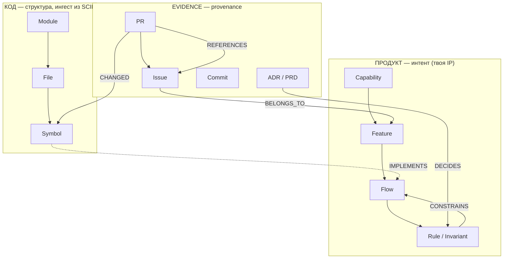

# Тех-дизайн: граф связности **код ↔ документация ↔ продукт**

*Ядро продукта «Why This Code». Это не «код-граф + прилепить доки» — это типизированный **трёхслойный граф трассируемости** с первоклассным слоем продукта/интента и provenance на каждом ребре.*

---

## 0. Идея в одной картинке

Три силоса сегодня не связаны: **код** (структура), **документация/решения** (улики), **продукт** (интент, обычно «в головах»). Мы строим граф, где:

- слой **продукта** — первоклассный (узлы = процессы и бизнес-правила, а не текст в вики);
- каждое **cross-layer ребро** несёт `provenance` (откуда взялась связь) и `confidence` (0..1);
- запрос **«почему этот код существует»** = многохоповый обход графа от кода вверх к продуктовому правилу и его обоснованию.

Это модернизация **Requirements Traceability Link Recovery (TLR)**. SOTA 2026: RAG + граф (Heterogeneous Graph Transformers кодируют «доменные стратегии как типы рёбер») + LLM, ~85% recovery. И там же вывод: из-за naming-bias и **phantom links** нужны review-интерфейсы и экспертная обратная связь. Значит, петля коррекции — часть архитектуры, а не опция.

---

## 1. Три слоя (узлы)



- **Код (структура).** Repo → Module → File → Symbol. **Не строим сами** — ингестим **SCIP** (Sourcegraph, заменил LSIF; `scip-typescript`/`scip-java`; sub-second defs/refs). Важно: SCIP — это L1-индекс (go-to-def / find-refs), в нём **нет dataflow и impact-анализа** — нам в MVP и не надо.
- **Продукт (интент) — твоя IP.** Capability → Feature → Flow → Rule/Invariant. Слой, которого нет ни у кого как у явной сущности.
- **Evidence (provenance).** PR, Commit, Issue, ADR, PRD, Doc, Decision. «Улики», обосновывающие рёбра.

---

## 2. Рёбра (типизированные, направленные, взвешенные)

| Ребро | Откуда | Тип источника |
|---|---|---|
| `IMPORTS / CALLS / DEFINES` (code→code) | SCIP | детерминированный |
| `OWNED_BY` (code→person/team) | CODEOWNERS | детерминированный |
| `CHANGED` (PR/Commit→Symbol/File) | git log/blame | детерминированный |
| `REFERENCES` (PR→Issue) | «Closes #45» | детерминированный |
| `BELONGS_TO` (Issue→Feature) | tracker API (epic/label) | детерминированный |
| `DECIDES` (ADR→Rule), `DESCRIBES` (PRD→Feature) | front-matter / парсинг | детерм. / инференс |
| **`IMPLEMENTS` (Symbol→Flow/Rule)** ← корона | эмбеддинги + LLM | **инференс → подтверждение** |
| `CONSTRAINS` (Rule→Flow), `PART_OF` (Flow→Feature→Capability) | парсинг / инференс | смешанный |

Каждое ребро: `{ type, source: deterministic | inferred | human, confidence: 0..1, evidence: [ids], created_at }`.

---

## 3. Главный запрос: «почему этот код существует» = обход

Пример пути:

```
Symbol(validateRefund)
   —CHANGED← PR#412
   —REFERENCES→ Issue#377
   —BELONGS_TO→ Feature(Refunds)
   ←CONSTRAINS— Rule("возврат только в течение 30 дней")
   ←DECIDES— ADR-014
```

Рендерим цепочку с confidence по каждому хопу и ссылками на улики. Это **многохоповый** запрос — именно здесь граф бьёт обычный vector-RAG: на multi-hop GraphRAG даёт 80–85% против 45–50% у вектора, а vector вырождается к нулю после ~5 сущностей в запросе. Поэтому «почему» — это граф, а не top-k чанков.

---

## 4. Движок построения рёбер (3 экстрактора)

1. **Детерминированные (confidence ≈ 1.0).** git log/blame → PR (merge `(#123)`), PR body «Closes #45», tracker API (issue→epic/label), CODEOWNERS, ADR front-matter → paths, conventional-commit scopes, аннотации в коде. Дёшево и точно — **выжимай максимум здесь**.
2. **Инференс (embeddings + LLM, confidence < 1).** Эмбеддинги символов и артефактов → кандидаты `IMPLEMENTS`; LLM подтверждает с рационале. Здесь и живут phantom links → только как **предложения**, не факты.
3. **Человек-в-петле.** Подтвердить / отклонить / поправить. Подтверждённое ребро = ground truth и сигнал для матчера. **Это твой проприетарный граф интента — моат, которого нет у RAG-ботов (Unblocked/Glean).**

**Freshness:** на новых PR — переэкстракт; инференс-рёбра со временем теряют confidence (decay), пока не подтверждены.

---

## 5. Хранилище и стек

Архитектура **гибридная** (граф + вектор), потому что SOTA — это роутер: вектор для recall, граф для multi-hop «почему».

- **OSS / локально:** **SQLite** (узлы/рёбра как таблицы + recursive CTE для обхода) + **sqlite-vec** для эмбеддингов. Ноль инфры — `npx` и поехали; критично для adoption на Show HN. *Граф-нативная альтернатива: **KùzuDB** (встраиваемый граф с вектор-индексом) — красиво, но SQLite проще и привычнее команде.*
- **Hosted / платно:** Postgres + pgvector (Supabase), та же схема узлов/рёбер + рекурсивные обходы; масштаб, шеринг, командная петля коррекции.
- **Код-слой:** SCIP-индексеры — своё разрешение имён не пишем.
- **Эмбеддинги:** провайдер-агностик (OpenAI / Anthropic / локальные).
- **Поверхности:** CLI `why`; **MCP-сервер** (v2 `registerTool`), который отдаёт *подграф* вокруг файлов в контексте как **структурированный** контекст, а не top-k чанков; позже — веб-UI для петли коррекции.

Минимальная схема:

```sql
nodes(id, type, layer, key, attrs jsonb, embedding vector)
edges(id, src, dst, type, source, confidence, evidence jsonb, created_at)
```

Обход — recursive CTE по `edges` с фильтром по типам рёбер и порогу confidence.

MCP-поверхность (иллюстративно, v2 SDK):

```ts
server.registerTool(
  "why_code",
  { description: "Продуктовый контекст для файла/символа",
    inputSchema: z.object({ path: z.string(), symbol: z.string().optional() }) },
  async ({ path, symbol }) => ({
    content: [{ type: "text", text: renderSubgraph(traverseWhy(path, symbol)) }]
  })
);
```

---

## 6. MVP-срез (что строим первым, по вечерам)

Сузить безжалостно:

- **Слои:** Code (через SCIP, **один язык** — TS или язык твоего демо-репо) + Evidence (**git + только GitHub Issues**) + Product в зачаточном виде (**Feature = epic/label**; Rule пока не выводим).
- **Рёбра:** только детерминированные `CHANGED`, `REFERENCES`, `BELONGS_TO`. `IMPLEMENTS`/инференс — фаза 2.
- **Запрос:** `why <file>` → цепочка PR → Issue → Feature с provenance.
- **Поставки:** CLI + MCP-сервер. Дашборд и петля коррекции — фаза 2.

Это уже отвечает на «почему этот код существует» **на детерминированных данных** (ноль phantom links) и даёт сильное Show-HN демо.

---

## 7. Открытые вопросы (нужен твой выбор)

1. **Гранулярность кода в MVP:** file-level (проще) vs symbol-level (точнее, дороже)? → *Моя рекомендация: file-level в MVP, symbol-level через SCIP в фазе 2.*
2. **Продуктовый слой:** только деривация из трекера (epic/label = Feature) vs ручной ввод правил? → *Реком.: деривация в MVP; Rule/Invariant — фаза 2 через инференс + подтверждение.*
3. **Локальный движок:** SQLite + sqlite-vec vs KùzuDB? → *Реком.: SQLite для MVP.*
4. **Выдача MCP:** сырой подграф (агент синтезирует сам) vs пред-суммаризация? → *Реком.: сырой подграф — дешевле, честнее, сила остаётся у агента.*

---

## Прайор-арт (на чём стоим)

- **TLR — Requirements Traceability Link Recovery** (дисциплина-предок; RAG+граф+LLM, ~85% recovery, нужны review-интерфейсы).
- **SCIP / LSIF** (код-слой); **Code Property Graph / CodeGraph** (пример графа code↔requirements на Neo4j).
- **GraphRAG** (почему граф для multi-hop «почему»: 80–85% vs 45–50% у вектора).

*Дальше: зафиксируем 4 выбора из раздела 7 — и я генерю репозиторий-скелет ровно под эту схему (SCIP-ингест → SQLite граф → `why` CLI + MCP-сервер).*
